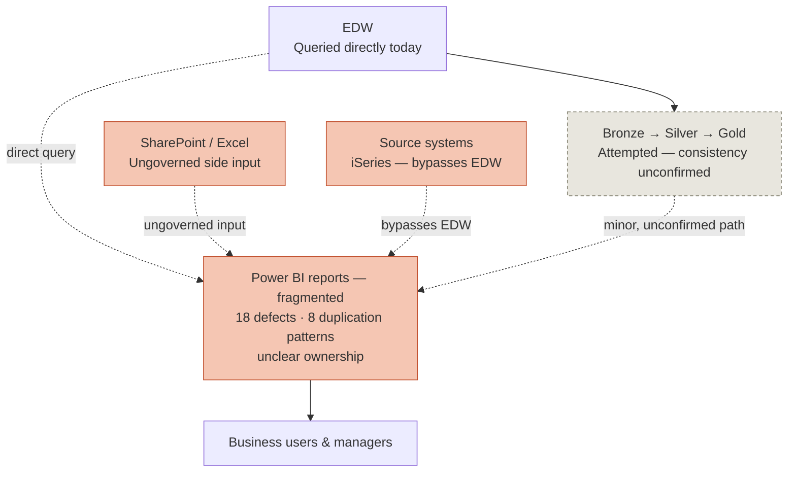
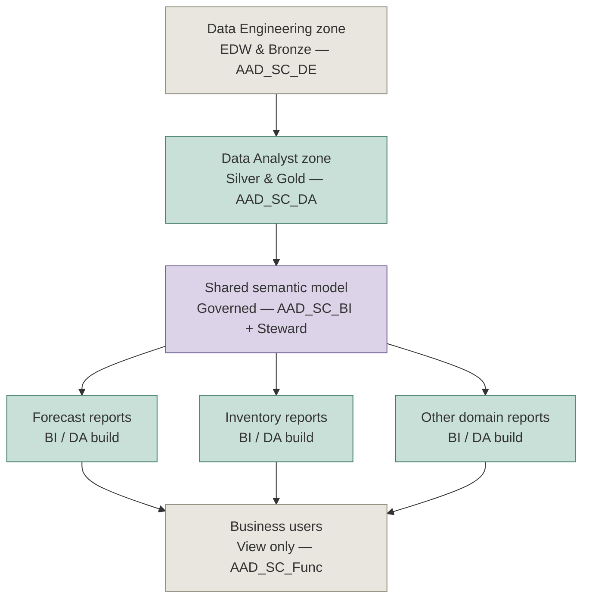

# Supply Chain Data Governance & Fabric Migration Proposal
### Draft — for review with Cherry before presenting to Devon / leadership

| Field | Value |
|---|---|
| Prepared by | Lucas Trinh (PO — VN Analytics / Discovery Lead) |
| Governance framework author | Cherry Bui (Data Analyst Lead) — this proposal sequences and timelines her recommendations; it does not originate them |
| Status | **Draft — not yet reviewed with Cherry** |
| Date | 2026-07-13 |
| Evidence base | `DW_Developer.TableDictionary` (6,489-object EDW audit, 2026-02-10), Eagle Eye Discovery repo (`control-tower-discover`) — 31 fully-analyzed Power BI reports as of 2026-07-13, 18 verified defects, 8 estate-wide patterns (both counts pending refresh from the newest analyses — see `01-evidence/track-a-reports/_catalog/`), `07-fabric-build` gold-layer build status |

---

## 1. Purpose

Ashley is migrating legacy data onto Fabric while, in parallel, individual departments continue hiring their own analysts to build reports directly against the raw data warehouse. This proposal:

1. Documents the **current state (AS-IS)** of how teams actually access and use data today, grounded in real numbers — not impressions.
2. Lays out the **target state (TO-BE)**, applying Cherry's governance framework (data catalog, change-proposal process, table registry, AAD-group access model) to the specific problem of moving teams from unrestricted self-service to a request-based model.
3. Proposes a **phased roadmap** sequencing both the technical rebuild (EDW → Bronze → Silver → Gold → Semantic Model) and the governance rollout together, since neither succeeds without the other — and states plainly what we get at the end of each phase.

This document is a **discussion draft**. Section 7 lists what still needs Cherry's and the data team's confirmation before this goes to Devon.

---

## 2. Executive Summary

- The EDW currently holds **6,489 tables across 433 schemas**. Of these, **601 haven't been modified in over 2 years** (76 in over 5), **806 have no modification date at all**, and only **8 tables (0.12%) have ever had a PII review** — including one table with an unflagged partial SSN field.
- Separately, **31 Power BI reports analyzed in depth (as of 2026-07-13) all connect directly to the EDW or to an ungoverned source of some kind**, bypassing any Bronze/Silver/Gold cleaning layer. This is independently confirmed by 18 verified data-quality defects and 8 estate-wide duplication patterns already catalogued in the Eagle Eye Discovery repo — both counts due for a refresh now that 5 more reports have been analyzed since they were last tallied.
- These two findings describe the **same root cause from two different layers**: there is currently no enforced gate between raw data and the people building reports on it. Both data engineers (informally) and department-hired analysts can — and do — query the EDW directly.
- Cherry has already proposed the correct target-state mechanism: a governed catalog, a change-proposal process for new tables, a table registry, and an AAD-group-based access model. What's missing is **sequencing, a concrete "what we get at each stage," and a way to point leadership at real numbers**, which is what this document adds.
- **Recommended principle:** govern the data foundation before restricting who can build reports on it. Restricting access to an ungoverned base only hides the problem; it doesn't fix it.

---

## 3. Current State (AS-IS)

### 3.1 What the EDW audit shows

Source: `DW_Developer.TableDictionary`, exported 2026-02-10, 6,489 rows.

| Finding | Number | Why it matters |
|---|---|---|
| Total tables/objects | 6,489 across 433 schemas | Scale of the estate to be rationalized |
| Supply Chain / Demand Planning schemas specifically | 13+ schemas, ~320 tables, several with parallel `_Wrk` staging copies | The domain this program is directly responsible for |
| Not modified in 2+ years | 601 tables | Deprecation candidates |
| Not modified in 5+ years | 76 tables | High-confidence deprecation candidates |
| No modification date recorded at all | 806 tables | Can't even assess these without manual investigation |
| Tables with flagged invalid-record counts | 758 tables | Known, tracked data-quality debt |
| Tables with any PII classification | 8 / 6,489 (0.12%) | Governance gap — not a documentation lag, a real compliance exposure |
| — of which, confirmed PII field | `Distribution_DW.DimDriverDetails` — partial SSN | Concrete example, not hypothetical |
| Tables built via a named ETL tool | 5,333 / 6,489 (82%) | Most tables **do** go through a formal pipeline (ADF, Databricks, stored procedures) |
| Tables tracked in source control (TFS) | 623 / 6,489 (~10%) | The pipelines are real, but their definitions are largely **not version-controlled or reviewed** |

**Important nuance confirmed during this analysis:** the high ETL-tool and job-schedule coverage (82%/76%) means most of the EDW is **not** the product of ungoverned, ad hoc table creation by random users — it's built through real pipelines, just with very weak metadata discipline (who owns it, what's in it, whether it's still needed). This is a different problem from the one at the report layer (below), and needs a different fix (documentation and source-control discipline, not access revocation).

### 3.2 What the report-layer analysis shows

Separately, and independently, the Eagle Eye Discovery program fully analyzed 25 of the ~26 Power BI reports the Supply Chain organization runs on. Every one of them connects directly to `ashley-edw.database.windows.net` / `ASHLEY_EDW` — the same database the table dictionary above catalogs. None of them read from a Bronze, Silver, or Gold layer.

The consequence, already documented in the discovery repo:
- **18 verified or reported defects** — e.g., two "identical" Forecast Accuracy reports use different bias thresholds (8% vs. 10%); a months-of-supply calculation in Inventory Management is statistically distorted; a date typo silently disabled a forecast correction for an entire cycle.
- **8 estate-wide duplication patterns**, including: 879 measures across the estate collapse to only 253 distinct calculations, of which 64 are duplicated with drifted logic across models; a single product-lifecycle classification is reimplemented under 4 different names across 16 models.

**Confirmed operating model (as described by the Discovery Lead, pending Cherry's validation):** Data Engineering owns the EDW and produces a Bronze layer; Data Analysts are meant to clean Bronze into Silver and build Gold from it for business reporting. In practice, **teams and department-hired analysts also query the EDW directly** to build their own Power BI reports, bypassing Bronze/Silver/Gold entirely. Whether the intended Bronze→Silver→Gold path is used consistently by the central data team itself is **not yet confirmed** — see Section 7.

### 3.2.1 — Non-warehouse source inventory (itemized)

The "ungoverned side input" problem isn't abstract — it's traceable to specific files and connections, already catalogued:

**SharePoint / Excel — hand-maintained, feeding production reports (9 reports depend on these):**

| Report | Files / lists |
|---|---|
| AFT_SI-SS_PSW | `Userfields Master File (CC,EVC,ABCXYZ).xlsx`, `VENDOR LIST AFT & 232.xlsx`, `Wanek Item DRP Breakdown.xlsx`, `NFM Item Filter.xlsx`, planner SharePoint list |
| Demand Review | Multiple SharePoint lists + Excel (Bedding, DemandPlanning, SCPGlobalTeam sites) |
| Top Negatives, Inv Management | SharePoint working files (vendor/negative-SI, excess/capacity) |
| GF Act+Fcst, Forecast Accuracy (Cust_ItWh / ItWh), Product Review (NEW), Supplier On-Time Performance | SharePoint/Excel + dataflow — customer filters, bias parameters, vendor penalty tables |

Recurring themes worth **one governed home** instead of per-report copies: Consumer Choice/EVC flags, ABC-XYZ segmentation, planner/analyst assignment, vendor office/mentor mapping, forecast-bias thresholds.

**iSeries ODBC — direct reads from manufacturing floor systems (2 reports, both 🔴):**

| Report | Source |
|---|---|
| DvC - WanekMillenium | iSeries ODBC: WFVNPROD (Wanek), MILPROD (Millenium), AFIPROD |
| Rolling Report - Wanek Millen | iSeries ODBC |

**Power BI / Power Platform dataflows — semi-governed, but often shadow a DW table (11 reports):**
Act+Fcst by WNK & MILL Prod Resource, Act+Fcst vs Manufacturing, Amazon POS Sales and Forecast, Inventory Health, Production Capacity Vs Forecast, Safety Stock Analysis, Supply Plan Detail, Supply Plan Detail Accuracy, Weekly Trend Analysis, Inventory Transactions and Item Balance Detail, When to Disco v2.

The clearest concrete example of the "shadow" problem: **`PowerBI_SupplyChain.CurrentProductDetails` (a dataflow) duplicates `SupplyChain_DW.DimCurrentProductDetails` (the DW master)** — the same product dimension exists twice, one governed and one not, and reports draw from both inconsistently.

**A third, distinct ungoverned pattern (found 2026-07-13, not yet in the original governance framework):** Plan Detail Timeline sources from `PowerBI_SupplyChain.SchedulingPlannedDetailTimeline` — **a single SQL view, queried directly with no dataflow or certified-dataset layer and no date filter** (the query pulls the view's entire history on every refresh). This differs from both patterns above: it's inside the EDW boundary, not outside it, but has no governance checkpoint of its own — if the view definition changes upstream, the report breaks silently. Worth naming as its own category: **"ungoverned view within a governed database."**

*Full detail and per-report notes: `01-evidence/source-model-docs/` and `02-group-analysis/source-governance.md` in the knowledge library merged into `00-foundation/`.*

### 3.3 AS-IS data flow

### 3.4 Root cause

Both findings above point to the same structural gap: **there is no enforced boundary between the raw EDW and the people building analytical reports.** Data Engineering has real pipelines but weak documentation; report builders (central team and department-hired analysts alike) query the EDW directly because nothing stops them and no governed alternative reliably exists yet. Restricting access without first building a trustworthy Gold layer would just push people back to informal workarounds — this is why Section 5's roadmap sequences governance *artifacts* before governance *enforcement*.

---

## 4. Target State (TO-BE)

This section applies Cherry's governance framework as-proposed. Where content below is a direct restatement of her recommendation, it's marked **[Cherry]**.

### 4.1 TO-BE data flow with access zones

Key change from AS-IS: **no path exists from business users, or from a new report, back to the raw EDW.** Everything is built on top of the shared, governed semantic model. Multiple teams (Forecast, Inventory, and future domains) build their own reports, but all from the same governed foundation — this is what allows self-service to continue safely, instead of being shut off entirely.

### 4.2 Access model — AAD Groups **[Cherry]**

| AAD Group | Role | Primary permissions |
|---|---|---|
| `AAD_SC_DE` | Data Engineer | Build pipelines, manage raw data |
| `AAD_SC_DA` | Data Analyst | Reuse data, analyze, create insights |
| `AAD_SC_BI` | BI Developer | Build PBIX files, semantic models, PBI Apps |
| `AAD_SC_Lead` | Team Lead | Governance, approval, oversight |
| `AAD_SC_Steward` | Metadata Owner | Define, audit, document |
| `AAD_SC_Func_<Team>` | Business user | View data/reports via App + RLS only |

### 4.3 Governance artifacts **[Cherry]**

**Data Catalog + Data Dictionary (§8.1).** A single place to check before creating a new table, to avoid duplication or misunderstanding. Should contain: schema description, table/business definitions, column descriptions, sample records, data-quality status, business glossary + metric definitions, one defined business-area scope per team, silver→gold ownership, last-updated date, related metrics, and layer (bronze/silver/gold). Tooling: Fabric Datahub/Purview if available; otherwise Excel/OneNote/Confluence/SharePoint glossary as an interim.

**Data Change Proposal Process (§8.2).** Same idea as a pull request for code: any new table or major change is submitted with purpose, source data, consuming team, and proposed name, then goes through a short review — if it conflicts with an existing table, it gets redirected or merged instead of created new.

**Table Registry (§8.3).** Before creating a new table, submit an entry to a `Registered_Tables` list (name, owner, created date, layer, related tables, conflicts, approved-by). Automatic alerts fire on name collisions or business-use-case overlap.

**Shared-table usage rules (§8.4).** Any shared Silver/Gold table needs a named data steward, version control for major changes, and a change log. Checklist Cherry proposed as the baseline for "governance is working":
- 🎯 Clear ownership defined for every table/dashboard
- 📘 Data catalog + dictionary exists for Supply Chain
- 🔎 A proposal process exists for new tables/dashboards, with duplicate detection
- 👁️ Quarterly PBI dashboard review to clean up unused/duplicate reports

**Onboarding & tooling.** New hires should, from day one: know what data already exists, know who owns it, be able to request access easily, use the standard template, and never build a duplicate. Standard docs: naming convention, PBIX layout guide, semantic/RLS standards, release checklist, data-quality ruleset. Onboarding checklist: add to AD group, grant Dev workspace access, send PBIX template, grant catalog access, assign semantic/lakehouse permissions, complete "what exists + how to reuse" training.

**Automated Access Request.** A Microsoft Form or PowerApp capturing user, role, domain, and justification — routes a Teams notification to the relevant steward, who assigns the AD group and grants access, replacing informal/undocumented requests.

Two additional policies Cherry flagged as needed but not yet drafted: a **Dashboard Creation Policy** (who can create a new dashboard, through what process, how often it's reviewed) and a **KPI Governance Charter** (who owns each KPI definition, how often it's reviewed).

---

## 5. Roadmap — and what we get at each stage

Every phase below produces a concrete, checkable result — not just "activity completed." That result is what Section 5.1 and each phase's **Expected Outcome** column describe, and it's what should be reported back to Devon at each gate.

| Phase | Duration | Goal | Key actions | Expected Outcome |
|---|---|---|---|---|
| **0 — Audit & Baseline** | 2–4 weeks | Know exactly where we stand | Clean up the table dictionary itself (CreatedBy is 99% blank; some rows have shifted/malformed columns). Identify true owners for the 601 (esp. 76 very-stale) candidate-deprecation tables. Resolve/triage the 758 invalid-record flags. Run a full PII sweep — don't trust the 8 already-flagged rows. Audit current Fabric workspace access (who has Contributor/Admin where) against Cherry's AAD group model. | A **validated, owned table inventory** replacing a 99%-blank ownership field; a **ranked deprecation list** starting from the 601+76 stale tables; a **real PII risk register**, not 8 accidental flags; a **current-state access map**. This becomes the single baseline every later phase is measured against — for the first time, "how much sprawl do we actually have" has a number, not an impression. |
| **1 — Foundational governance artifacts** | 4–8 weeks (overlaps Phase 0 tail) | Build the mechanism, don't enforce yet | Stand up Data Catalog + Table Registry for Supply Chain specifically (not company-wide on day one). Create the AAD groups but mirror current access initially — don't revoke anything yet. Draft Dashboard Creation Policy + KPI Governance Charter for Devon's sign-off. | A **live, searchable Data Catalog + Table Registry** for Supply Chain — anyone can check "does this already exist" before building. AAD groups **provisioned** (access unchanged yet). Two policies **drafted and ready for sign-off**. Nothing is blocked yet, but for the first time there is one governed place to check, not zero. |
| **2 — Controlled parallel run** | 8–12 weeks | New things go through the process; old things are tolerated for now | All **new** tables/dashboards require the change-proposal + registry process. Begin quarterly PBI dashboard reviews, starting with reports dependent on the 601+76 stale tables. Onboarding checklist becomes mandatory for new hires. Continue gold-layer build, prioritized to Forecast/Inventory per Devon's Phase 1. | **Net-new duplication growth slows toward zero** — every new table/dashboard is now visible and checked before it's built. **First quarterly cleanup pass completed**, with a real count of dashboards flagged/retired. **Gold-layer coverage measurably expands** for Forecast/Inventory. Every new hire from this point on **never learns the old ad hoc habit** — the sprawl-creation pattern stops being taught to newcomers, even before it's fully shut off for existing staff. |
| **3 — Enforcement & governed self-service** | 4–6 months from start | Flip the default | Contributor-level workspace access becomes justification-required, not default; standard business users get Viewer/App + RLS access per `AAD_SC_Func_<Team>`. Automated Access Request goes live. The 601+76 stale-table list enters a scheduled deprecation process (not abrupt deletion). | **Direct EDW query access removed** for non-DE roles. **Automated Access Request replaces informal asks** — every access grant is now logged and justified. **This is the phase where "self-build → request" actually completes** — the exact behavior change this whole program exists to produce. Stale-table deprecation is **actively executing**, not just planned. |
| **4 — AI agent integration** | After Phase 3 stabilizes | The Eagle Eye AI insight layer | Only begins once the catalog + registry have reached critical mass. | AI agent answers are **grounded in the governed semantic layer**, not raw ungoverned tables — with an explainability trail (the discovery repo's bug log / patterns registry) available for anything it surfaces. **First AI-assisted decision-support use case goes live**, on Forecast or Inventory per Devon's priority — the payoff every earlier phase existed to make safe. |

### 5.1 What we get once the full roadmap is complete

Put together, the end state is:

- **One governed source of truth** in place of 6,489 loosely-tracked tables and 25+ independently-duplicated reports.
- **A documented, request-based access model** — `AAD_SC_Func_<Team>` view access by default, build access granted on justified request — replacing today's informal, unlogged access grants.
- **Departments no longer need to hire their own analyst just to get a report built** — they search a catalog they can access themselves, and request against a known, governed foundation instead of reverse-engineering the EDW from scratch.
- **PII and compliance exposure is closed, not just documented** — from a 0.12% review rate to a completed sweep with named owners.
- **A foundation an AI agent can actually be trusted to reason over** — because the defects and duplication patterns already found (18 defects, 8 patterns) get fixed at the source instead of being silently inherited by whatever sits on top.
- **Governance that stays healthy instead of decaying again** — the quarterly review cadence and registry process mean this doesn't quietly regress to today's state 18 months from now.

---

## 6. Risks if we don't act

- **Compliance exposure grows silently.** 99.88% of the EDW has never had a PII review, and we already have one confirmed unflagged partial-SSN field. Every month this goes unaddressed is additional exposure, not a static risk.
- **The new Gold layer inherits the old disease.** If access governance isn't fixed alongside the rebuild, new ad hoc dashboards will proliferate on top of the new gold layer within 12–18 months, exactly as they did on the EDW.
- **Departments keep hiring shadow-DA capacity.** Every month without a credible, fast, self-service-on-governed-data alternative, departments have more incentive to solve the problem themselves — which is what created the current sprawl.
- **Technical debt compounds.** 758 tables already have known data-quality flags; left untouched, downstream reports built on them keep multiplying the problem (as seen in 18 verified defects already found in just 31 reports, and counting).

---

## 7. Open questions — needs Cherry / data team confirmation before this goes to Devon

1. **Is the Bronze → Silver → Gold path actually used consistently by the central data team today**, or is Silver mostly skipped in practice (with each report doing its own ad hoc cleaning, as the report-layer evidence suggests)? This changes the scope of Phase 1/2 significantly.
2. **How many people/teams currently have direct EDW query access, and through what mechanism** (individual SQL logins? one shared AD group? a read replica?) — needed to size Phase 3 realistically.
3. **Is the future "semantic model" layer meant to be one centralized model, or one governed model per domain that teams can extend?** Changes how strict the AAD_SC_BI gate needs to be.
4. **Is there already a deadline or dedicated project for cutting off direct EDW access**, or is this still an open-ended future intention? The roadmap above should align to that if it exists.
5. **Are the multi-entity-looking schema names (e.g., `_AFI` / `_WVF` / `_WNK` suffixes) legitimate separate business entities, or accumulated duplication?** Affects how Phase 0's audit should be scoped. *Partial evidence already points to "legitimate": the iSeries systems behind the Manufacturing reports — `WFVNPROD` (Wanek), `MILPROD` (Millenium), `AFIPROD` — are three distinct, real production systems tied to separate vendor facilities, not an artifact of duplicate reporting. Still needs Cherry/data team to confirm this holds for the EDW schema suffixes specifically, not just the iSeries side.*

---

## 8. Next steps

1. Review this draft with Cherry — confirm Section 4 accurately represents her framework, and get her input on Section 7.
2. Incorporate her corrections, then prepare a leadership-facing summary (shorter, Devon/Amanda-oriented) referencing this as the full backing document.
3. Get sign-off on Phase 0 scope and start the EDW/access audit.
