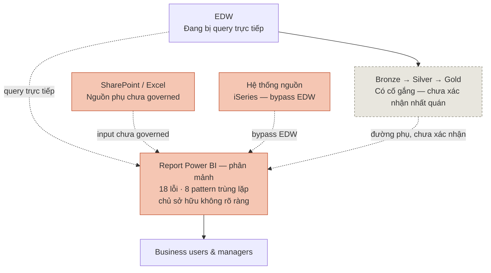
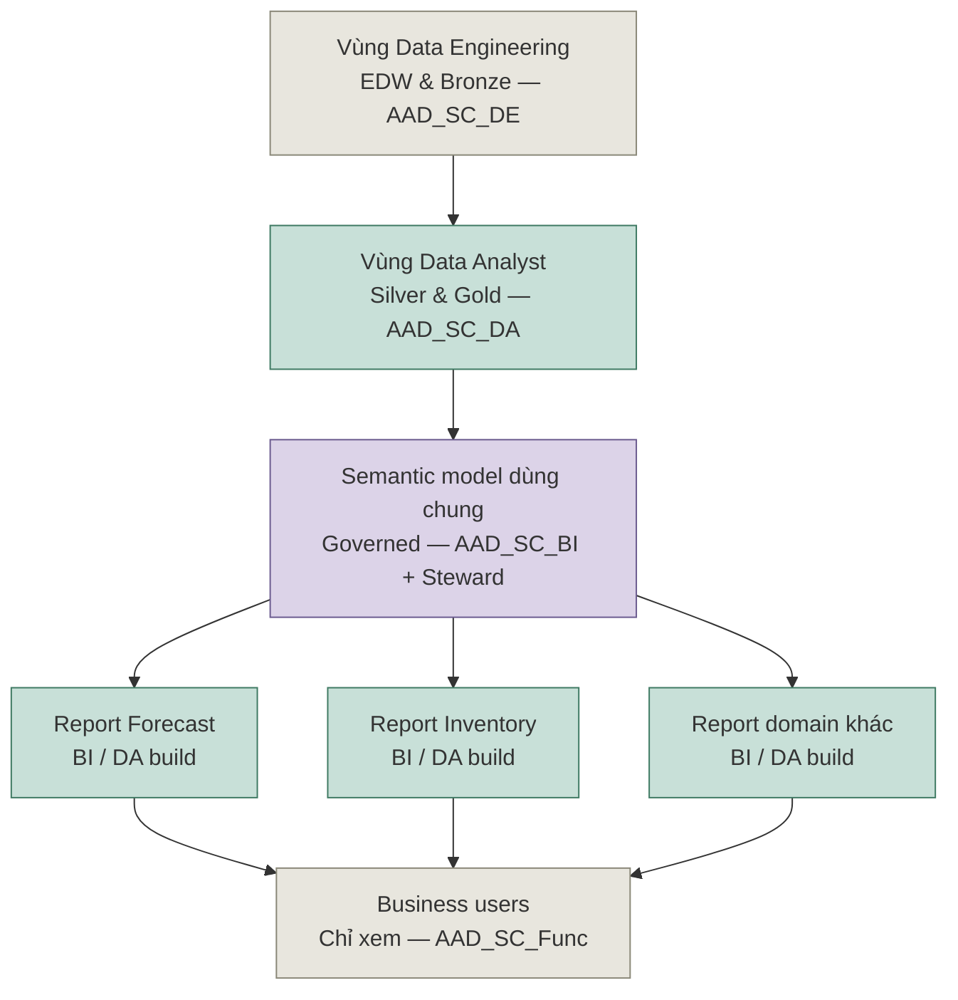

# Đề xuất Quản trị Dữ liệu & Lộ trình Fabric — Supply Chain
### Bản nháp — để review cùng Cherry trước khi trình Devon / leadership

| Trường | Giá trị |
|---|---|
| Người soạn | Lucas Trinh (PO — VN Analytics / Discovery Lead) |
| Tác giả khung governance | Cherry Bui (Data Analyst Lead) — tài liệu này sắp xếp trình tự + gắn timeline cho đề xuất của Cherry, không phải ý tưởng gốc của tôi |
| Trạng thái | **Bản nháp — chưa review cùng Cherry** |
| Ngày | 2026-07-13 |
| Nguồn bằng chứng | `DW_Developer.TableDictionary` (audit 6,489 object EDW, 2026-02-10), repo Eagle Eye Discovery (`control-tower-discover`) — 31 report Power BI đã phân tích đầy đủ (tính đến 13/07/2026), 18 lỗi đã verify, 8 pattern lặp lại toàn estate (2 số này đang chờ cập nhật lại theo 5 report mới phân tích thêm), tiến độ build gold layer trong `07-fabric-build` |

---

## 1. Mục đích

Ashley đang migrate dữ liệu legacy lên Fabric, trong khi song song đó các department vẫn tiếp tục tự tuyển analyst riêng để build report trực tiếp trên data warehouse thô. Tài liệu này:

1. Ghi lại **hiện trạng (AS-IS)** cách các team thực sự đang truy cập và sử dụng dữ liệu — dựa trên số liệu thật, không phải cảm nhận.
2. Trình bày **trạng thái đích (TO-BE)**, áp dụng khung governance của Cherry (data catalog, quy trình đề xuất thay đổi, table registry, mô hình phân quyền theo AAD group) vào đúng bài toán: đưa các team từ tự build không kiểm soát sang mô hình request-based.
3. Đề xuất **lộ trình theo pha**, sắp xếp song song cả việc rebuild kỹ thuật (EDW → Bronze → Silver → Gold → Semantic Model) lẫn việc triển khai governance — vì thiếu 1 trong 2 thì không thành công — và nói rõ **kết quả cụ thể nhận được sau mỗi pha**.

Đây là **bản nháp để thảo luận**. Mục 7 liệt kê những gì còn cần Cherry và data team xác nhận trước khi trình Devon.

---

## 2. Tóm tắt điều hành

- EDW hiện có **6,489 bảng trên 433 schema**. Trong đó, **601 bảng không được update quá 2 năm** (76 bảng quá 5 năm), **806 bảng không có ngày update nào cả**, và chỉ **8 bảng (0.12%) từng được review PII** — bao gồm 1 bảng có field SSN (một phần) chưa được gắn cờ.
- Riêng biệt, **31 report Power BI đã phân tích sâu (tính đến 13/07/2026) đều kết nối trực tiếp vào EDW hoặc 1 nguồn chưa được governed**, bỏ qua hoàn toàn tầng làm sạch Bronze/Silver/Gold. Điều này được xác nhận độc lập bởi 18 lỗi dữ liệu đã verify và 8 pattern trùng lặp toàn estate đã catalog trong repo Eagle Eye Discovery.
- Hai phát hiện này mô tả **cùng một nguyên nhân gốc từ 2 tầng khác nhau**: hiện không có cổng kiểm soát nào giữa dữ liệu thô và người build report trên đó. Cả data engineer (không chính thức) lẫn analyst do department tự tuyển đều có thể — và đang — query EDW trực tiếp.
- Cherry đã đề xuất đúng cơ chế cho trạng thái đích: catalog có governance, quy trình đề xuất thay đổi cho bảng mới, table registry, và mô hình phân quyền theo AAD group. Cái còn thiếu là **trình tự, một câu trả lời cụ thể cho "mỗi giai đoạn ta nhận được gì"**, và cách đưa số liệu thật ra trước leadership — đó là phần tài liệu này bổ sung.
- **Nguyên tắc đề xuất:** governance nền dữ liệu trước, rồi mới siết ai được build report trên đó. Siết quyền truy cập trên một nền chưa governed chỉ che giấu vấn đề, không giải quyết được nó.

---

## 3. Hiện trạng (AS-IS)

### 3.1 Audit EDW cho thấy gì

Nguồn: `DW_Developer.TableDictionary`, export ngày 2026-02-10, 6,489 dòng.

| Phát hiện | Số liệu | Vì sao quan trọng |
|---|---|---|
| Tổng số bảng/object | 6,489 trên 433 schema | Quy mô estate cần hợp lý hoá |
| Riêng schema Supply Chain / Demand Planning | 13+ schema, ~320 bảng, nhiều bảng có bản sao staging `_Wrk` song song | Domain chương trình này trực tiếp chịu trách nhiệm |
| Không update quá 2 năm | 601 bảng | Ứng viên deprecate |
| Không update quá 5 năm | 76 bảng | Ứng viên deprecate độ tin cậy cao |
| Không có ngày update nào | 806 bảng | Không thể đánh giá nếu không điều tra thủ công |
| Bảng có flag invalid-record count | 758 bảng | Nợ chất lượng dữ liệu đã biết, đã tracked |
| Bảng có bất kỳ phân loại PII nào | 8 / 6,489 (0.12%) | Lỗ hổng governance — không phải thiếu tài liệu, mà là rủi ro compliance thật |
| — trong đó, field PII đã xác nhận | `Distribution_DW.DimDriverDetails` — SSN (một phần) | Ví dụ cụ thể, không phải giả định |
| Bảng được build qua ETL tool có tên cụ thể | 5,333 / 6,489 (82%) | Phần lớn bảng **thực sự** đi qua pipeline chính thức (ADF, Databricks, stored procedure) |
| Bảng được track trong source control (TFS) | 623 / 6,489 (~10%) | Pipeline có thật, nhưng định nghĩa của nó phần lớn **không nằm trong version control hay được review** |

**Điểm quan trọng cần lưu ý đã xác nhận trong phân tích này:** tỷ lệ phủ ETL tool và job lịch chạy cao (82%/76%) nghĩa là phần lớn EDW **không phải** sản phẩm của việc tạo bảng tự phát, không kiểm soát bởi người dùng ngẫu nhiên — nó được build qua pipeline thật, chỉ là kỷ luật metadata rất yếu (ai sở hữu, có gì bên trong, còn cần dùng không). Đây là vấn đề khác với vấn đề ở tầng report (bên dưới), và cần cách xử lý khác (kỷ luật tài liệu hoá + source control, không phải thu hồi quyền truy cập).

### 3.2 Phân tích tầng report cho thấy gì

Riêng biệt và độc lập, chương trình Eagle Eye Discovery đã phân tích đầy đủ 25/26 report Power BI mà tổ chức Supply Chain đang vận hành. Tất cả đều kết nối trực tiếp tới `ashley-edw.database.windows.net` / `ASHLEY_EDW` — đúng database mà table dictionary ở trên catalog. Không report nào đọc từ tầng Bronze, Silver hay Gold.

Hệ quả, đã được ghi lại trong repo discovery:
- **18 lỗi đã verify hoặc ghi nhận** — ví dụ: 2 report Forecast Accuracy "giống hệt nhau" dùng ngưỡng bias khác nhau (8% vs 10%); phép tính months-of-supply trong Inventory Management bị méo về mặt thống kê; 1 lỗi ngày tháng khiến 1 điều chỉnh forecast bị vô hiệu âm thầm cho cả 1 chu kỳ.
- **8 pattern trùng lặp toàn estate**, bao gồm: 879 measure trên toàn estate thu gọn còn 253 phép tính khác biệt thật sự, trong đó 64 bị trùng lặp với logic trôi dạt xuyên các model; 1 phân loại lifecycle sản phẩm được implement lại dưới 4 tên khác nhau trên 16 model.

**Mô hình vận hành đã xác nhận (theo mô tả của Discovery Lead, đang chờ Cherry xác nhận):** Data Engineering sở hữu EDW và tạo ra tầng Bronze; Data Analyst được kỳ vọng làm sạch Bronze thành Silver và build Gold từ đó cho business reporting. Trên thực tế, **các team và analyst do department tự tuyển cũng query EDW trực tiếp** để tự build report Power BI, bỏ qua hoàn toàn Bronze/Silver/Gold. Việc luồng Bronze→Silver→Gold dự kiến có được chính data team trung tâm dùng nhất quán hay không **chưa được xác nhận** — xem Mục 7.

### 3.3 Luồng dữ liệu AS-IS

### 3.4 Nguyên nhân gốc

Cả hai phát hiện trên đều chỉ về cùng 1 lỗ hổng cấu trúc: **không có ranh giới được kiểm soát giữa EDW thô và người build report phân tích.** Data Engineering có pipeline thật nhưng tài liệu hoá yếu; người build report (cả team trung tâm lẫn analyst department tự tuyển) query EDW trực tiếp vì không có gì ngăn cản, và chưa có lựa chọn thay thế governed nào đáng tin cậy. Siết quyền truy cập trước khi có tầng Gold đáng tin cậy chỉ đẩy mọi người quay lại cách làm không chính thức — đây là lý do lộ trình ở Mục 5 sắp xếp *xây dựng cơ chế governance* trước *thực thi governance*.

---

## 4. Trạng thái đích (TO-BE)

Mục này áp dụng đúng khung governance Cherry đã đề xuất. Chỗ nào là diễn đạt lại trực tiếp từ đề xuất của cô ấy sẽ đánh dấu **[Cherry]**.

### 4.1 Luồng dữ liệu TO-BE kèm vùng phân quyền

Thay đổi quan trọng so với AS-IS: **không còn đường nào từ business users, hay từ 1 report mới, quay ngược lại EDW thô.** Mọi thứ được build trên nền semantic model dùng chung, đã governed. Nhiều team (Forecast, Inventory, và các domain tương lai) tự build report riêng, nhưng đều từ cùng 1 nền governed — đây chính là cách self-service tiếp tục an toàn, thay vì bị đóng hoàn toàn.

### 4.2 Mô hình phân quyền — AAD Group **[Cherry]**

| AAD Group | Vai trò | Quyền chính |
|---|---|---|
| `AAD_SC_DE` | Data Engineer | Xây dựng pipeline, quản lý dữ liệu |
| `AAD_SC_DA` | Data Analyst | Tái sử dụng dữ liệu, phân tích, tạo insight |
| `AAD_SC_BI` | BI Developer | Xây dựng PBIX, semantic model, PBI App |
| `AAD_SC_Lead` | Team Lead | Quản trị, phê duyệt, giám sát |
| `AAD_SC_Steward` | Metadata Owner | Định nghĩa, kiểm toán, tài liệu hoá |
| `AAD_SC_Func_<Team>` | Business user | Xem dữ liệu/report qua App & RLS |

### 4.3 Các artifact governance **[Cherry]**

**Data Catalog + Data Dictionary (§8.1).** Một nơi duy nhất để kiểm tra trước khi tạo bảng mới, tránh trùng lặp hoặc hiểu sai. Cần có: mô tả schema, định nghĩa bảng/business, mô tả cột, ví dụ bản ghi, trạng thái chất lượng dữ liệu, từ điển thuật ngữ nghiệp vụ + định nghĩa metric, mỗi team có 1 phạm vi business area xác định, chủ sở hữu silver→gold, ngày cập nhật cuối, metric liên quan, và layer (bronze/silver/gold). Tooling: Fabric Datahub/Purview nếu có; nếu chưa, dùng tạm Excel/OneNote/Confluence/SharePoint glossary.

**Quy trình Đề xuất Thay đổi Dữ liệu (§8.2).** Giống pull request cho code: mọi bảng mới hoặc thay đổi lớn được submit kèm mục đích, dữ liệu nguồn, team sử dụng, tên đề xuất — rồi qua 1 vòng review ngắn gọn — nếu conflict với bảng khác thì chuyển hướng hoặc hợp nhất thay vì tạo mới.

**Table Registry (§8.3).** Trước khi tạo bảng mới, submit 1 entry vào danh sách `Registered_Tables` (tên, chủ sở hữu, ngày tạo, layer, bảng liên quan, xung đột, phê duyệt bởi). Tự động cảnh báo khi trùng tên hoặc overlap business use case.

**Quy định sử dụng bảng dùng chung (§8.4).** Bất kỳ bảng Silver/Gold dùng chung nào cũng cần 1 data steward được chỉ định, version control cho thay đổi lớn, và change log. Checklist Cherry đề xuất làm chuẩn cho "governance đang hoạt động":
- 🎯 Xác định rõ chủ sở hữu cho mọi bảng/dashboard
- 📘 Data catalog + dictionary tồn tại cho Supply Chain
- 🔎 Có quy trình đề xuất cho bảng/dashboard mới, kèm phát hiện trùng lặp
- 👁️ Review dashboard PBI mỗi quý để dọn report không dùng/trùng lặp

**Onboarding & tooling.** Nhân sự mới, ngay từ ngày đầu, cần: biết dữ liệu nào đã có, biết ai sở hữu, xin quyền dễ dàng, dùng đúng template chuẩn, không build trùng lặp. Tài liệu chuẩn: naming convention, PBIX layout guide, chuẩn semantic/RLS, release checklist, data quality ruleset. Checklist onboarding: thêm vào AD group, cấp quyền workspace Dev, gửi PBIX template, cấp quyền data catalog, phân quyền semantic/lakehouse, hoàn thành training "cái gì đã có + cách tái sử dụng".

**Automated Access Request.** Một Microsoft Form hoặc PowerApp thu thập người dùng, vai trò, domain, lý do — gửi thông báo Teams tới steward liên quan, người này gán AD group và cấp quyền, thay thế cho các yêu cầu không chính thức/không ghi log.

Hai policy bổ sung Cherry đã nêu là cần thiết nhưng chưa soạn thảo: **Dashboard Creation Policy** (ai được tạo dashboard mới, qua quy trình gì, review lại bao lâu 1 lần) và **KPI Governance Charter** (ai sở hữu định nghĩa mỗi KPI, chu kỳ review bao lâu).

---

## 5. Lộ trình — và kết quả nhận được ở mỗi giai đoạn

Mỗi pha dưới đây tạo ra 1 kết quả cụ thể, kiểm chứng được — không chỉ là "đã làm xong việc". Kết quả đó được mô tả ở Mục 5.1 và cột **Expected Outcome** của từng pha — đây chính là những gì nên báo cáo lại cho Devon ở mỗi cột mốc.

| Pha | Thời gian | Mục tiêu | Việc cụ thể | Expected Outcome |
|---|---|---|---|---|
| **0 — Audit & Baseline** | 2–4 tuần | Biết chính xác đang đứng ở đâu | Làm sạch chính table dictionary (CreatedBy trống 99%; một số dòng bị lệch/hỏng cột). Xác định chủ sở hữu thật cho 601 bảng (đặc biệt 76 bảng rất cũ) — ứng viên deprecate. Xử lý/phân loại 758 flag invalid-record. Chạy PII sweep toàn diện — không tin vào 8 dòng đã flag sẵn. Audit quyền truy cập Fabric workspace hiện tại (ai có Contributor/Admin ở đâu) đối chiếu mô hình AAD group của Cherry. | Một **danh mục bảng đã xác thực, có chủ sở hữu** thay cho field ownership trống 99%; một **danh sách deprecate đã xếp hạng** bắt đầu từ 601+76 bảng cũ; một **sổ rủi ro PII thật**, không phải 8 dòng flag tình cờ; một **bản đồ quyền truy cập hiện tại**. Đây trở thành baseline duy nhất để đo mọi pha sau — lần đầu tiên "mức độ sprawl thực sự là bao nhiêu" có con số, không phải cảm nhận. |
| **1 — Dựng nền governance** | 4–8 tuần (chồng lấn cuối Pha 0) | Xây cơ chế, chưa ép thực thi | Dựng Data Catalog + Table Registry riêng cho Supply Chain (không làm toàn công ty ngay). Tạo AAD group nhưng giữ nguyên quyền hiện tại ban đầu — chưa thu hồi gì. Soạn Dashboard Creation Policy + KPI Governance Charter trình Devon ký. | Một **Data Catalog + Table Registry sống, tìm kiếm được** cho Supply Chain — bất kỳ ai cũng kiểm tra được "cái này đã có chưa" trước khi build. AAD group **đã được tạo** (quyền chưa đổi). 2 policy **đã soạn xong, sẵn sàng ký duyệt**. Chưa có gì bị chặn, nhưng lần đầu tiên có 1 nơi governed để kiểm tra, thay vì không có gì cả. |
| **2 — Chạy song song có kiểm soát** | 8–12 tuần | Cái mới phải qua quy trình; cái cũ tạm được chấp nhận | Mọi bảng/dashboard **mới** bắt buộc qua quy trình đề xuất + registry. Bắt đầu review dashboard PBI hàng quý, đợt đầu nhắm vào report phụ thuộc 601+76 bảng cũ. Checklist onboarding bắt buộc với nhân sự mới. Tiếp tục build gold layer, ưu tiên Forecast/Inventory theo Phase 1 của Devon. | **Tốc độ trùng lặp mới chậm dần về 0** — mọi bảng/dashboard mới giờ đều hiện ra và được kiểm tra trước khi build. **Đợt dọn dẹp quý đầu tiên hoàn thành**, có con số thật về dashboard bị gắn cờ/loại bỏ. **Độ phủ Gold layer mở rộng đo lường được** cho Forecast/Inventory. Mọi nhân sự mới từ thời điểm này **không còn học thói quen tự build tuỳ ý** — pattern tạo sprawl ngừng được truyền lại cho người mới, kể cả trước khi bị chặn hoàn toàn với nhân sự cũ. |
| **3 — Thực thi & self-service có governance** | 4–6 tháng từ lúc bắt đầu | Đảo ngược mặc định | Quyền Contributor trên workspace chuyển thành cần lý do, không còn mặc định; business user chuẩn nhận quyền Viewer/App + RLS theo `AAD_SC_Func_<Team>`. Automated Access Request go-live. Danh sách 601+76 bảng cũ bước vào quy trình deprecate có lịch trình (không xoá đột ngột). | **Quyền query trực tiếp EDW bị thu hồi** với các vai trò không phải DE. **Automated Access Request thay thế yêu cầu không chính thức** — mọi cấp quyền giờ được log và có lý do. **Đây là pha mà "tự build → request" thực sự hoàn thành** — đúng thay đổi hành vi mà cả chương trình này tồn tại để tạo ra. Việc deprecate bảng cũ **đang thực thi thật**, không chỉ nằm trên kế hoạch. |
| **4 — Tích hợp AI agent** | Sau khi Pha 3 ổn định | Lớp AI insight của Eagle Eye | Chỉ bắt đầu khi catalog + registry đã đạt khối lượng đủ tin cậy. | Câu trả lời của AI agent **dựa trên nền semantic layer đã governed**, không phải bảng thô chưa governed — kèm dấu vết giải thích (bug log/patterns registry của repo discovery) cho bất kỳ điều gì nó nêu ra. **Use case AI-assisted decision-support đầu tiên go-live**, trên Forecast hoặc Inventory theo ưu tiên của Devon — đây là thành quả mà mọi pha trước tồn tại để làm cho an toàn. |

### 5.1 Kết quả nhận được khi hoàn thiện toàn bộ lộ trình

Gộp lại, trạng thái cuối cùng là:

- **Một nguồn sự thật duy nhất, có governance** thay cho 6,489 bảng theo dõi lỏng lẻo và 25+ report trùng lặp độc lập.
- **Mô hình phân quyền dựa trên request, có tài liệu** — mặc định chỉ xem qua `AAD_SC_Func_<Team>`, quyền build cấp theo yêu cầu có lý do — thay cho việc cấp quyền không chính thức, không ghi log như hiện tại.
- **Department không còn cần tự tuyển analyst riêng chỉ để có report** — họ tìm trong catalog tự truy cập được, và request trên 1 nền đã biết, đã governed, thay vì tự dò lại EDW từ đầu.
- **Rủi ro PII/compliance được đóng lại, không chỉ được ghi nhận** — từ tỷ lệ review 0.12% thành 1 đợt sweep hoàn chỉnh có chủ sở hữu cụ thể.
- **Một nền tảng AI agent thực sự có thể tin tưởng để suy luận trên đó** — vì các lỗi và pattern trùng lặp đã tìm thấy (18 lỗi, 8 pattern) được sửa tại gốc thay vì bị kế thừa âm thầm bởi bất kỳ thứ gì xây trên đó.
- **Governance duy trì được sức khoẻ thay vì suy thoái trở lại** — chu kỳ review hàng quý và quy trình registry nghĩa là 18 tháng sau sẽ không âm thầm quay lại hiện trạng hôm nay.

---

## 6. Rủi ro nếu không hành động

- **Rủi ro compliance âm thầm tăng lên.** 99.88% EDW chưa từng được review PII, và đã có 1 field SSN (một phần) chưa gắn cờ được xác nhận. Mỗi tháng chưa xử lý là thêm rủi ro thật, không phải rủi ro tĩnh.
- **Gold layer mới sẽ kế thừa đúng căn bệnh cũ.** Nếu governance quyền truy cập không được xử lý song song với việc rebuild, dashboard tự phát mới sẽ mọc lên trên gold layer mới trong 12–18 tháng tới, giống hệt những gì đã xảy ra trên EDW.
- **Department tiếp tục tuyển shadow-DA.** Mỗi tháng không có lựa chọn self-service đáng tin cậy, nhanh, trên nền đã governed, department càng có động lực tự giải quyết vấn đề — chính là điều đã tạo ra sprawl hiện tại.
- **Nợ kỹ thuật tiếp tục cộng dồn.** 758 bảng đã có flag chất lượng dữ liệu; nếu không xử lý, report downstream xây trên đó tiếp tục nhân rộng vấn đề (như 18 lỗi đã verify chỉ từ 31 report, và còn tiếp tục tăng).

---

## 7. Câu hỏi còn mở — cần Cherry / data team xác nhận trước khi trình Devon

1. **Luồng Bronze → Silver → Gold có thực sự được data team trung tâm dùng nhất quán hôm nay không**, hay Silver phần lớn bị bỏ qua trong thực tế (mỗi report tự "clean" theo cách riêng, như bằng chứng tầng report cho thấy)? Điều này ảnh hưởng đáng kể đến phạm vi Pha 1/2.
2. **Hiện có bao nhiêu người/team đang có quyền query EDW trực tiếp, qua cơ chế nào** (SQL login riêng? 1 AD group chung? read replica?) — cần để tính quy mô Pha 3 chính xác.
3. **Tầng "semantic model" tương lai là 1 model tập trung duy nhất, hay 1 model governed riêng cho mỗi domain mà team có thể mở rộng?** Ảnh hưởng đến mức độ siết chặt cần thiết của cổng AAD_SC_BI.
4. **Đã có deadline hoặc dự án riêng cho việc chặn quyền EDW trực tiếp chưa**, hay vẫn là ý định tương lai chưa có lịch? Lộ trình trên nên khớp theo deadline đó nếu đã tồn tại.
5. **Các tên schema trông như multi-entity (hậu tố `_AFI` / `_WVF` / `_WNK`) là các entity kinh doanh riêng biệt hợp lệ, hay trùng lặp tích luỹ theo thời gian?** Ảnh hưởng đến cách scope audit ở Pha 0.

---

## 8. Bước tiếp theo

1. Review bản nháp này cùng Cherry — xác nhận Mục 4 phản ánh đúng khung của cô ấy, và lấy input cho Mục 7.
2. Tiếp thu các chỉnh sửa của cô ấy, sau đó chuẩn bị bản tóm tắt cho leadership (ngắn hơn, hướng tới Devon/Amanda), tham chiếu tài liệu này làm bản đầy đủ đi kèm.
3. Xin ký duyệt phạm vi Pha 0 và bắt đầu audit EDW/quyền truy cập.
